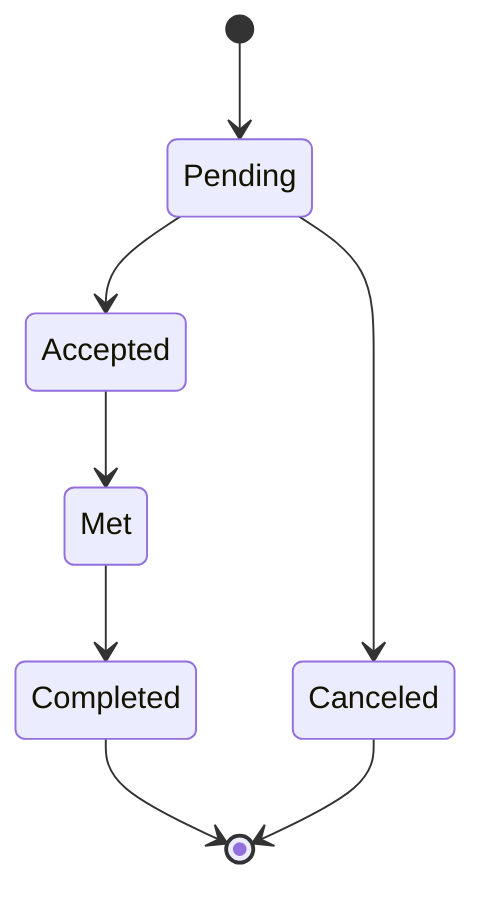

# Trading on UniBooks

UniBooks keeps it simple: **all trades happen in person, on campus.**

## Why Meetups

- Platform community is built for trust within a university setting
- Zero fees, zero intermediaries
- You can inspect the book yourself before committing any money

## On-Campus Meetup: Step by Step

1. **Message the seller** — hit "Contact Seller" on a book page.
2. **Agree on time and place** — use the in-app chat to set a convenient meeting spot. Choose a public space like a library or student lounge.
3. **Inspect the book** — start reviewing content, check annotations or condition discrepancies.
4. **Confirm in the app** — once verified, tip the "complete" button to end the transaction.

## Basic Safety

- **Meet in public places** — library, convenience store, dorm lobby.
- **Bring cash / your payment method** — what the seller accepts is between you.
- **Teammates are fine** — if you're uncomfortable going alone, bring a school friend.

## Order Status Diagram

| Status | Meaning |
|---|---|
| Pending | Buyer has placed an order, waited accept |
| Accepted | Seller confirmed; both are arranging a meet-up |
| Met | Exchanged books in person |
| Completed | Confirmed; order done |
| Canceled | Canceled before meet-up, no funds exchanged |

## Cancellations

| Who | Until |
|---|---|
| Buyer | Before the seller **accepts** |
| Seller | Before the meetup date |

- Frequent cancellations may impact account standings
- Shows announce community accountability

## $0 price listing (Free Books)

Intend to give away your old book for free? Set the price to **$0**.
- Always completely free, no charge ever
- Zero-price titles appear in a highlighted "Free Books" section

## What to Report

For suspicious or untrustworthy users or incorrect listings, see [Reporting Support](/about/faq)