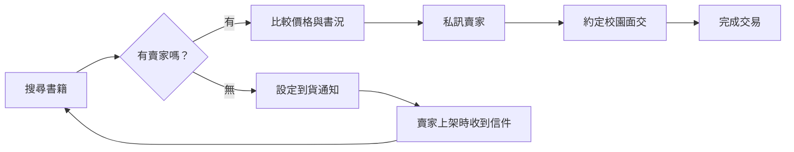

# 新手上路

歡迎使用 UniBooks！本篇指南將帶你快速了解平台的基本使用方式。

---

## UniBooks 是什麼？

UniBooks 是專為台灣大專院校學生打造的**二手教科書搜尋與媒合平台**。我們以 ISBN 為核心，將同一本書的所有賣家聚合在一個頁面上，讓你一站搜尋、比價、聯繫、完成交易。

---

## 不需登入就能使用

你可以直接瀏覽、搜尋所有書籍，完全不需要註冊或登入。只有當你想**刊登販售**、**私訊賣家**或**設定到貨通知**時，才需要建立帳號。

---

## 建立帳號

1. 前往 UniBooks 首頁，點擊「註冊」
2. 輸入你的姓名、密碼，以及你的 **`.edu.tw` 學校信箱**
3. 系統會發送驗證信到你的學校信箱，點擊信中連結完成驗證
4. 驗證成功後即可使用完整功能

> **注意**：本平台限大專院校在學學生使用。每學期開學後需重新驗證 `.edu.tw` 信箱以確認在學身份。

---

## 平台首頁

登入後的首頁提供以下功能入口：

- **搜尋列**：輸入 ISBN、書名或課堂名稱，即時搜尋書籍
- **到貨通知**：想買的書尚無刊登？點擊「通知我」，上架時到提醒
- **我的刊登**：查看與管理你上架的書籍
- **我的訊息**：查看與買/賣家的聊天記錄
- **我的訂閱**：管理所有已訂閱的到貨通知

---

## 核心運作方式

---

## 下一步

- 了解如何[搜尋書籍](/guide/search)
- 了解如何[刊登販售](/guide/listing)
- 了解[交易流程](/guide/transactions)細節
- 了解[到貨通知](/guide/waitlist)機制