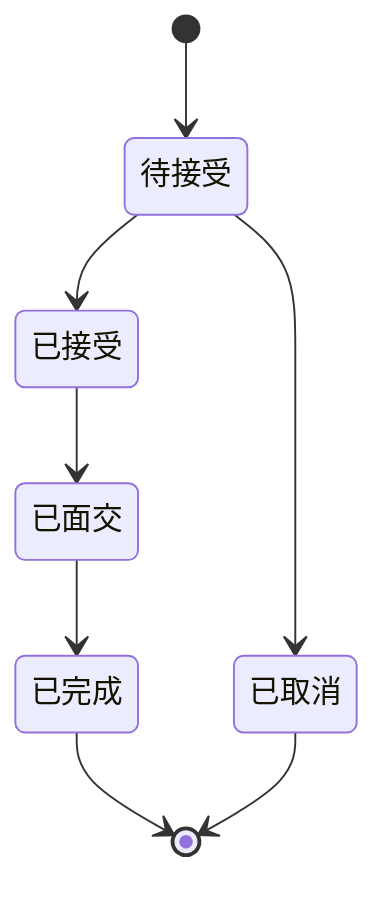

# 交易方式

UniBooks 堅持簡單與透明：所有交易一律採用校園面交。

## 為何只採校園面交？

在學學生彼此的信任比任何其他機構更寶貴。UniBooks 專精於「同校熟人紡學經濟」：
- 零中期手續費
- 現場驗書，手感由你作主
- 交易即時完成

學生應於同校圖書館、宿舍交誼廳等公共場所會面。

## 校內面交：完整流程

### 操作步驟

1. **傳訊息給賣家**：在書籍頁點擊「聯絡賣家」，表明對書的興趣。
2. **雙方約定時間地點**：透過平台聊天窗口，確認接書的時事與聚集點。推薦圖書館、便利商店等多人公共地區。
3. **現場驗收書籍狀況**：見面時仔細檢查書的新舊痕跡、缺頁或筆記，比對賣家描述。
4. **App 內確認交易完成**：核準無誤後點確認，賣家即收到知信。

## 安全小提醒

- **選擇公共場所**：圖書館、宿舍交誼廳、學校便利商店。
- **攜帶現金或其他支付方式**：由買賣雙方自由決定。
- **建議多人同行**：初次面交可請朋友陪同。

## 訂單狀態圖

每筆訂单流程：

| 狀態 | 說明 |
|---|---|
| 待接受 | 買家提出訂單，等待賣家接受 |
| 已接受 | 賣家確認，等待線上面議 |
| 已面交 | 雙方碰頭，現場交換與驗收 |
| 已完成 | 確認沒問題，訂單結束 |
| 已取消 | 任何一方在合適階段取消 |

## 訂單取消

| 購買方能否取消 | 條件 |
|---|---|
| 買家取消 | 可在賣家**接受訂單之前**隨時取消 |
| 賣家取消 | 可在雙方面交前取消 |

- 頻繁取消訂單可能影響帳號信用信評、影響未來操作。

## 免費（零元）贈書

想無償送出教本、閒置的舊書？只需要在刊登時將價格設為 **0 元**。
- 無類費，為營利平台不涉中費用
- 系統能將零元書籍集中於專區，需要者一眼找到

> **提醒** — 零元贈書也建議面交，確保即時到書。

---

## 留意狀況

檢舉不實刊登或通報未遵守承諾的賣家，參閱[檢舉/申訴](/about/faq#安全)